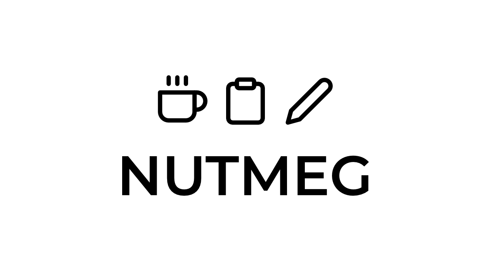

<div align="center">
    
</div>

<h3 align="center">A dead simple note taking app built for the web.</h3>
<h4 align="center">Work in Progress.</h4>

## Features
- Markdown Shortcuts

## Technology Stack
- VueJS
- ExpressJS
- MongoDB

## Try the app
**NOTE: The app is still a work in progress, this means it's a wreck at the moment.**
1. Clone the app
```
git clone https://github.com/scmmishra/nutmeg.git
```
2. `cd` into the repository
3. Run `yarn` or `npm install` whatever makes you roll.
4. Run `yarn run dev` on one terminal. P.S. You need to export an environment variable SECRET before running this. 🤦
5. Run `yarn run vue-serve` on another terminal

## License
GNU General Public License v3.0
